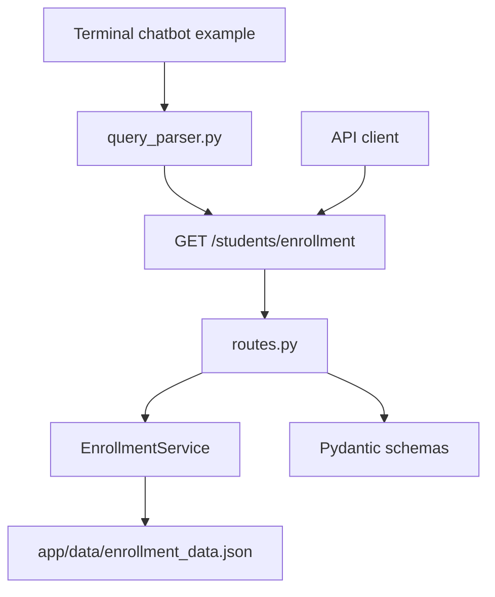

# Student Enrollment REST API and Terminal Chatbot

This project is a small FastAPI application for querying student enrollment counts by year. It also includes a terminal chatbot example that extracts a year from a natural-language question and asks the running API for the corresponding enrollment record.

## Problem Statement

The project demonstrates a simple API-backed chatbot flow:

```text
user question -> year extraction -> API request -> enrollment data response
```

It is not a Text-to-SQL system, does not use an LLM, and does not connect to a database server. The enrollment data is stored in a local JSON file.

## Architecture



## API Endpoints

| Method | Path | Description |
| --- | --- | --- |
| `GET` | `/` | Health check |
| `GET` | `/students` | List all enrollment records |
| `GET` | `/students/enrollment?year=2025` | Retrieve enrollment for one year |
| `POST` | `/students/enrollment` | Add an enrollment record |
| `PUT` | `/students/enrollment/{year}` | Update an enrollment record |
| `DELETE` | `/students/enrollment/{year}` | Delete an enrollment record |

## Request And Response Examples

Get enrollment:

```bash
curl "http://127.0.0.1:8000/students/enrollment?year=2025"
```

Response:

```json
{
  "year": 2025,
  "students": 1650
}
```

Add enrollment:

```bash
curl -X POST "http://127.0.0.1:8000/students/enrollment" \
  -H "Content-Type: application/json" \
  -d '{"year": 2027, "students": 1900}'
```

Response:

```json
{
  "message": "Enrollment record added",
  "year": 2027,
  "students": 1900
}
```

Unavailable year:

```json
{
  "detail": "No data for this year"
}
```

## Repository Structure

```text
student-enrollment-api-chatbot/
├── app/
│   ├── __init__.py
│   ├── main.py
│   ├── api/
│   │   ├── __init__.py
│   │   └── routes.py
│   ├── services/
│   │   ├── __init__.py
│   │   ├── enrollment_service.py
│   │   └── query_parser.py
│   ├── schemas/
│   │   ├── __init__.py
│   │   └── enrollment.py
│   └── data/
│       └── enrollment_data.json
├── tests/
├── examples/
│   └── chatbot.py
├── README.md
├── requirements.txt
├── .env.example
├── .gitignore
├── Dockerfile
├── LICENSE
└── pyproject.toml
```

## Local Installation

```bash
python -m pip install -e ".[dev]"
```

Or install from requirements:

```bash
python -m pip install -r requirements.txt
```

## Application Startup

Run the API locally:

```bash
uvicorn app.main:app --reload
```

Open:

```text
http://127.0.0.1:8000/docs
```

Run the terminal chatbot example in a separate terminal while the API is running:

```bash
python examples/chatbot.py
```

Example question:

```text
How many students enrolled in 2025?
```

## Testing

```bash
pytest
```

## Docker Usage

Build the image:

```bash
docker build -t student-enrollment-api-chatbot .
```

Run the container:

```bash
docker run -p 8000:8000 student-enrollment-api-chatbot
```

Then test:

```bash
curl "http://127.0.0.1:8000/students/enrollment?year=2025"
```
