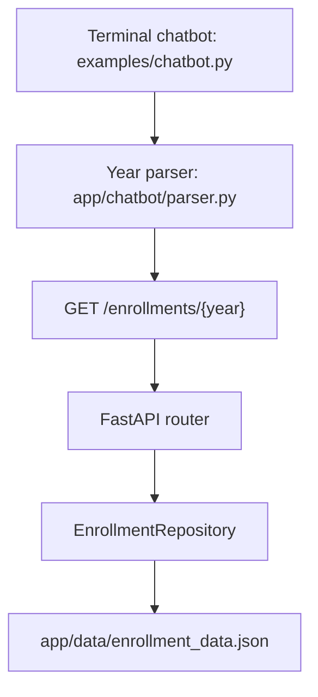

# Student Enrollment REST API and Terminal Chatbot

A small, read-only FastAPI application for querying annual enrollment counts, with a terminal chatbot that extracts a year and calls the API. The bundled JSON contains three example records: 2024 (1,700), 2025 (1,650), and 2026 (1,800). These are demonstration data, not a live institutional dataset.

The project uses FastAPI, Pydantic, Requests, and regular expressions. It has no LLM, PyTorch model, Text-to-SQL component, or database server.

## Architecture



Each application instance loads and validates the JSON once before serving requests. The repository returns immutable enrollment records and a fresh list for each collection query. Missing files, malformed JSON, duplicate years, invalid years, and invalid counts prevent startup. Years must be four-digit ASCII values from 1900 through 3000; counts must be nonnegative JSON integers (booleans, strings, and fractional values are rejected).

There are no write endpoints. To change the demonstration data, edit `app/data/enrollment_data.json` and restart the API. For Docker, rebuild and recreate the container. This intentionally replaces the previous in-memory CRUD design; clients using `/students` or the former root health route must migrate to the endpoints below.

## Quick start

Requires Python 3.10 or newer.

```bash
python -m venv .venv
source .venv/bin/activate
# Windows PowerShell: .venv\Scripts\Activate.ps1
python -m pip install -e ".[dev]"
uvicorn app.main:app --reload
```

Interactive API documentation: [Swagger UI](http://127.0.0.1:8000/docs).

`pyproject.toml` is the only dependency definition. For a runtime-only installation, use `python -m pip install .`. Dependency ranges are bounded by major version; this project does not provide a lockfile.

## API

| Method | Path | Behavior |
| --- | --- | --- |
| GET | `/health` | Returns `{"message":"API is running"}` |
| GET | `/enrollments` | Lists annual records in ascending year order |
| GET | `/enrollments/{year}` | Returns the count for a year between 1900 and 3000 |

```bash
curl http://127.0.0.1:8000/enrollments/2025
```

```json
{"year": 2025, "students": 1650}
```

A valid year without a record returns HTTP 404 with `{"detail":"No data for this year"}`. A noninteger or out-of-range year returns HTTP 422. Write methods on enrollment routes return HTTP 405. The `students` field is an aggregate count, not a list of student identities.

## Terminal chatbot

While the API is running, open another terminal in the repository and activate the same environment:

```bash
python examples/chatbot.py
# Optional API base URL (do not include /enrollments):
python examples/chatbot.py --api-url http://127.0.0.1:8000
```

```text
Ask me: How many students enrolled in 2025?
1650 students enrolled in 2025.
```

Each invocation answers one question. The parser accepts one distinct standalone four-digit year from 1900 through 3000; repeating the same year is allowed. Missing or out-of-range years and questions containing multiple distinct years are rejected before making an HTTP request. Comparisons and relative dates such as “last year” are unsupported. Parsing is lexical, not natural-language understanding: any standalone four-digit number is treated as a candidate year.

The client uses a 10-second request timeout and reports unavailable records, connection failures, timeouts, HTTP errors, malformed responses, and mismatched response years. The terminal script lives in the source checkout; the built Python package contains the API and parser, plus the bundled JSON.

## Repository layout

```text
app/
  main.py                    Application factory and ASGI entry point
  api/routes.py              Read-only routes
  chatbot/parser.py          Explicit year extraction
  repositories/enrollment.py JSON validation and lookup
  schemas/enrollment.py      Response models and shared year constraints
  data/enrollment_data.json  Demonstration records
examples/chatbot.py          Terminal HTTP client
tests/                     API, repository, parser, and chatbot tests
.github/workflows/ci.yml     Python checks and container smoke test
Dockerfile                  Non-root runtime image built from wheels
pyproject.toml              Package metadata, dependencies, and check configuration
```

## Verification

```bash
ruff check .
ruff format --check .
python -m compileall -q app examples
pytest
python -m build
```

Tests cover read-only API behavior, response contracts, data validation, snapshot isolation, parser rejection, and chatbot HTTP handling. Pytest enforces at least 95% combined statement and branch coverage for `app` and `examples`. GitHub Actions runs checks on Python 3.10–3.14, builds the distribution, verifies a wheel installation outside the checkout, and builds and smoke-tests the Docker image.

## Docker

```bash
docker build -t student-enrollment-api-chatbot .
docker run --rm -p 8000:8000 student-enrollment-api-chatbot
```

```bash
curl http://127.0.0.1:8000/health
curl http://127.0.0.1:8000/enrollments/2025
```

The image installs runtime dependencies only, runs as an unprivileged user, and includes an HTTP health check. No volume is required because the API does not write data. Run the terminal chatbot on the host against the exposed API port.

## License

MIT; see [LICENSE](LICENSE).
